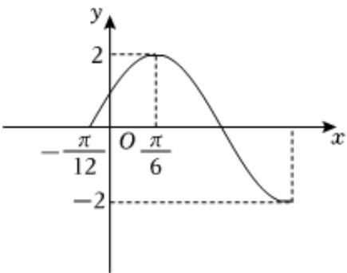

<!-- question-source:start -->
2、已知函数 $y = A \sin(\omega x + \varphi) (A > 0, \omega > 0, 0 < \varphi < \frac{\pi}{2})$ 的图象如图所示.

(1)求这个函数的解析式；

(2)求函数在区间 $\left[-\frac{\pi}{2}, -\frac{\pi}{12}\right]$ 上的最大值和最小值，并指出取得最值时的 $x$ 的值.

<!-- question-source:end -->

![[Q00090922A1]]
