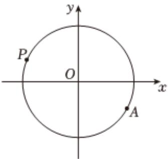

<!-- question-source:start -->
4、水车在古代是进行灌溉引水的工具，是人类的一项古老的发明，也是人类利用自然和改造自然的象征.如图是一个半径为R的水车，一个水斗从点 $A(3\sqrt{3}, -3)$ 出发，沿圆周按逆时针方向匀速旋转，且旋转一周用时60秒.经过t秒后，水斗旋转到P点，设P的坐标为 $(x, y)$ ，其纵坐标满足 $y = f(t) = R \sin(\omega t + \varphi) (t \geqslant 0, \omega > 0, |\varphi| < \frac{\pi}{2}).$

(1)求函数 $f(t)$ 的解析式；

(2)当 $t\in[35,55]$ 时，求点P到x轴的距离的最大值；

(3)当t=20时，求 $|PA|$ 的大小.

<!-- question-source:end -->

![[Q00090924A1]]
