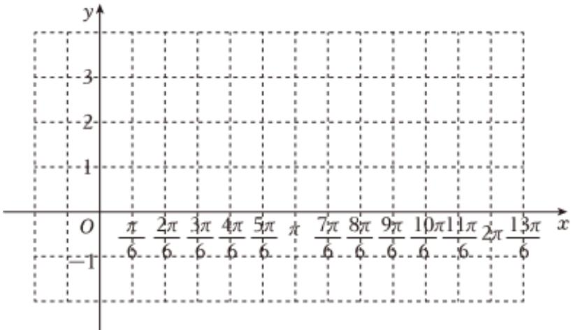

<!-- question-source:start -->
3、已知函数 $f(x) = 2\sin (\omega x + \varphi - \frac{\pi}{3})(\omega > 0, 0 < \varphi < \pi, x \in R)$ 为奇函数，且相邻两个对称轴之间的距离 $\frac{\pi}{2}$ .

(1)求 $f(x)$ 的最小正周期和单调增区间；

(2)若 $x\in[0,m]$ 时，方程 $f(x)=\sqrt{3}$ 恰有2个解，求实数m的取值范围.

(3)将函数 $f(x)$ 的图象向左平移 $\frac{\pi}{12}$ 个单位长度，把横坐标伸长到原来的2倍，纵坐标不变，再向上平移一个

单位，得到函数 $g(x)$ 的图象，用“五点法”画出 $g(x)$ 在 $[0, 2\pi]$ 上的图象.

<!-- question-source:end -->

![[Q00092364A1]]
