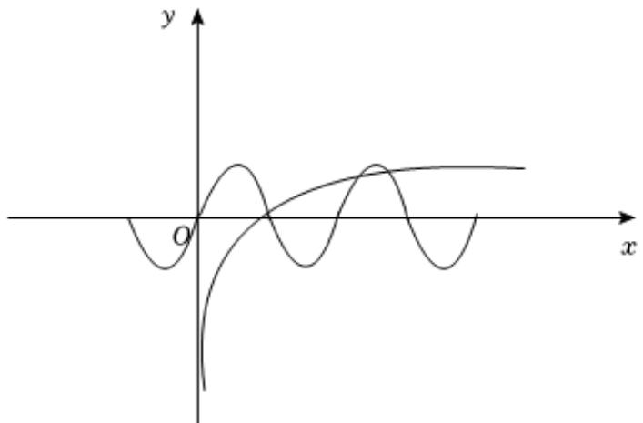

> [!faq]- 2024-2025学年内蒙古呼和浩特一中高一（下）第一次月考数学试卷解析
>
> > [!success]- **【答案】** 3
>
> > [!note]- **【解析】**
> > 在同一个平面直角坐标系中作出 $f(x)$ 和 $h(x)$ 的图象，如图，
> >
> > 
> >
> > 因为 $h(1) = 0$ ， $f\left(\frac{\pi}{2}\right) = 0$ ， $f\left(\frac{3\pi}{2}\right) = 0$ ， $h(5) = 1$ ， $f(2\pi) = 0$
> >
> > 故 $f(x)$ 和 $h(x)$ 的图象交点个数为3.
> >
> > 故答案为：3.
