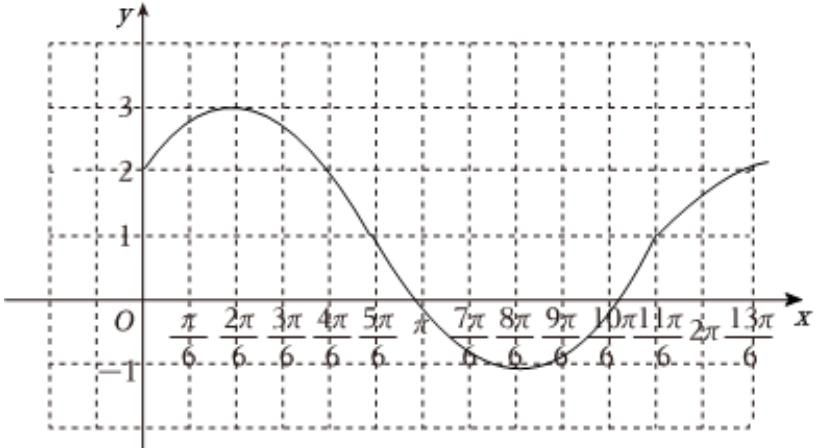

> [!faq]- 2024-2025学年内蒙古呼和浩特一中高一（下）第一次月考数学试卷解析
>
> > [!success]- **【答案】** 详见解析
>
> > [!note]- **【解析】**
> > 详见解析
> >
> > （1）因为函数 $f(x)=2\sin(\omega x+\varphi-\frac{\pi}{3})(\omega>0,0<\varphi<\pi,x\in R)$ 为奇函数，且相邻两个对称轴之间的距离 $\frac{\pi}{2}$ ，
> > 可得 $\left\{\begin{aligned}\varphi-\frac{\pi}{3}&=k\pi,k\in Z\\ T&=2\bullet\frac{\pi}{2}=\frac{2\pi}{\omega}\\ 0&<\varphi<\pi\end{aligned}\right.$ ，解得 $\omega=2,\varphi=\frac{\pi}{3}$ ，
> > 即 $f(x)=2\sin2x$ 令 $-\frac{\pi}{2}+2k\pi\leqslant2x\leqslant\frac{\pi}{2}+2k\pi,k\in Z$ 解得 $-\frac{\pi}{4}+k\pi\leqslant x\leqslant\frac{\pi}{4}+k\pi,k\in Z$ 可得函数的最小正周期 $T=\pi$ ，单调递增区间为 $\left[-\frac{\pi}{4}+k\pi,\frac{\pi}{4}+k\pi\right],k\in Z;$ (2)若 $x\in[0,m]$ 时，方程 $f(x)=\sqrt{3}$ 恰有2个解，
> > 可得 $\sin2x=\frac{\sqrt{3}}{2}$ 且 $2x\in[0,2m]$ 所以 $2m\in[\frac{2\pi}{3},\frac{7\pi}{3})$ ，解得 $m\in[\frac{\pi}{3},\frac{7\pi}{6})$ 即实数m的取值范围 $\left[\frac{\pi}{3},\frac{7\pi}{6}\right)$ ;
> > (3)函数 $f(x)$ 的图象向左平移 $\frac{\pi}{12}$ 个单位长度，可得 $y=2\sin[2(x+\frac{\pi}{12})]=2\sin(2x+\frac{\pi}{6})$ 再把横坐标伸长到原来的2倍，纵坐标不变，再向上平移一个单位，得到函数 $g(x)$ 则 $g(x)=2\sin(x+\frac{\pi}{6})+1$ $x\in[0,2\pi]$ ，可得 $x+\frac{\pi}{6}\in[\frac{\pi}{6},\frac{13\pi}{6}]$
> >
> > <table><tr><td>x</td><td>0</td><td> $\frac{\pi}{3}$ </td><td> $\frac{5\pi}{6}$ </td><td> $\frac{4\pi}{3}$ </td><td> $\frac{11\pi}{6}$ </td><td> $2\pi$ </td></tr><tr><td> $x + \frac{\pi}{6}$ </td><td> $\frac{\pi}{6}$ </td><td> $\frac{\pi}{2}$ </td><td> $\pi$ </td><td> $\frac{3\pi}{2}$ </td><td> $2\pi$ </td><td> $2\pi + \frac{\pi}{6}$ </td></tr><tr><td> $2\sin(x + \frac{\pi}{6})$ </td><td>1</td><td>2</td><td>0</td><td>-2</td><td>0</td><td>1</td></tr><tr><td>y=2sin(x+π/6)+1</td><td>2</td><td>3</td><td>1</td><td>-1</td><td>1</td><td>2</td></tr></table>
> >
> > 如下图所示：
> >
> > 
