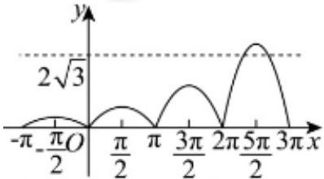

> [!faq]- 2024-2025学年内蒙古呼和浩特一中高一（下）第一次月考数学试卷解析
>
> > [!success]- **【答案】** 详见解析
>
> > [!note]- **【解析】**
> > 详见解析
> >
> > （1）由题意可知， $f(x+\pi)=2f(x)$ 对 $\forall x\in R$ 恒成立，
> >
> > 可知 $f(x)$ 在每个周期内的最大值随着 $\pmb{x}$ 的变大而变大，
> >
> > 当 $x\in(0,\pi]$ 时， $f(x)=\sin x$ ，
> >
> > 则 $x \in (\pi, 2\pi]$ 时， $x - \pi \in (0, \pi]$ ， $f(x) = 2f(x - \pi) = 2\sin (x - \pi)$ ，最大值为2，则 $x \in (2\pi, 3\pi]$ 时， $x - 2\pi \in (0, \pi]$ ， $f(x) = 2f(x - \pi) = 2^2 f(x - 2\pi) = 2^2 \sin (x - 2\pi)$ ，最大值为4，
> >
> > 令 $2^{2}\sin(x-2\pi)=2\sqrt{3}$ ， $x\in(2\pi,3\pi]$ ，
> >
> > 解得 $x=\frac{7\pi}{3}$ 或 $x=\frac{8\pi}{3}$ ，
> >
> > 
> >
> > 结合图象可知，对任意 $x\in(-\infty,t]$ ，都有 $f(x)\leq2\sqrt{3}$ 时，
> >
> > 实数的取值范围为 $\left(-\infty,\frac{7\pi}{3}\right]$ ;
> >
> > (2)存在，理由如下：
> >
> > 假设存在非零实数 $k$ ，使函数 $f(x) = \sin kx$ 是 $R$ 上的周期为 $T$ 的 $T$ 级类周期函数，
> >
> > 则 $f(x + T) = Tf(x)$ 对 $\forall T \neq 0, \forall x \in R$ 恒成立，
> >
> > 即 $\sin (kx + kT) = T\sin kx$ 对 $\forall T\neq 0$ ， $\forall x\in R$ 恒成立，
> >
> > 因为 $\sin (kx + kT)\in [-1,1],T\sin kx\in [-|T|,|T|]$
> >
> > 则 $T=\pm1$ ，当T=1时， $\sin(kx+k)=\sin kx$ ，
> >
> > $$
> > \text {得} k = 2 n _ {1} \pi , n _ {1} \in Z, n _ {1} \neq 0
> > $$
> >
> > 当 $T = -1$ 时， $\sin (kx - k) = -\sin kx$
> >
> > 得 $k=(2n_{2}+1)\pi,n_{2}\in Z$
> >
> > 综上， $k=2n_{1}\pi$ ， $n_{1}\in Z$ ， $n_{1}\neq0$ ，T=1或 $k=(2n_{2}+1)\pi$ ， $n_{2}\in Z$ ，T=-1。
