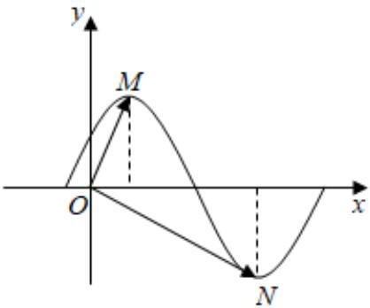

<!-- question-source:start -->
5、函数 $f(x) = \sin (\omega x + \varphi)$ ， $(\omega > 0, 0 < \varphi < \frac{\pi}{2})$ 在一个周期内的图象如图所示， $M$ 、 $N$ 分别是图象的最高点和最低点，其中 $M$ 点横坐标为 $\frac{1}{2}$ ， $O$ 为坐标原点，且 $\overrightarrow{OM} \cdot \overrightarrow{ON} = 0$ ，则 $\omega, \varphi$ 的值分别是（

B  

A $\frac{2\pi}{3}$ , $\frac{\pi}{6}$ B $\pi$ , $\frac{\pi}{3}$ C 2, $\frac{\pi}{4}$ D 1, $\frac{\pi}{3}$
<!-- question-source:end -->

![[Q00090890A1]]
