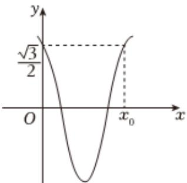

<!-- question-source:start -->
1、已知向量 $\overrightarrow{a} = (1, -1)$ ， $\overrightarrow{b} = (2, x)$ ，设 $\overrightarrow{a}$ 与 $\overrightarrow{b}$ 的夹角为 $\alpha$ ，则（）
A 若 $\overrightarrow{a} // \overrightarrow{b}$ ，则 x = -2
B 若 x = 1，则 $\left|\overrightarrow{b}-\overrightarrow{a}\right|=\sqrt{3}$ C 若 x = -1，则 $\overrightarrow{a}$ 与 $\overrightarrow{b}$ 的夹角为 $60^{\circ}$ D 若 $\overrightarrow{a} + 2\overrightarrow{b}$ 与 $\overrightarrow{a}$ 垂直，则 x = 3

<!-- question-source:end -->

![[Q00090896A1]]
