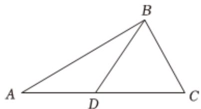

<!-- question-source:start -->
4、已知向量 $\overrightarrow{a} = (2\cos x, \sin x + 1)$ ， $\overrightarrow{b} = (2\sin x, -\cos x + 1)$ .

1 若 $\overrightarrow{a} // \overrightarrow{b}$ ，求 $\sin x \cos x$ 的值；

若函数 $f(x)=\overrightarrow{a}\cdot\overrightarrow{b}(x\in[0,\pi])$ ;

(i)求 $f(x)$ 的值域；

2 (ii) 当 $f(x)$ 取最小值时，求与 $\overrightarrow{a}$ 垂直的单位向量 $\overrightarrow{c}$ 的坐标.

如图，在 $\triangle ABC$ 中， $\angle ABC = 90^{\circ}$ ， $D$ 是斜边 $AC$ 上的一点， $AB = \sqrt{3} AD, BC = \sqrt{6}$ .

1 若 $\angle DBC = 60^{\circ}$ ，求 $\angle ADB$ 和 $\triangle ADB$ 的面积；

2 若 $BD = \sqrt{2}$ ，求 $\frac{CD}{DA}$ 的值.
<!-- question-source:end -->

![[Q00090906A1]]
