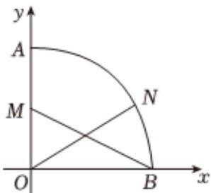

<!-- question-source:start -->
2. 如图，以O为坐标原点，建立直角坐标系xOy，扇形OAB的圆心角为 $90^{\circ}$ ，OA=2，点M为线段OA的中点，点N为弧AB上任意一点.

1 若 $\angle BON = 30^{\circ}$ ，试用向量 $\overrightarrow{OA}$ 、 $\overrightarrow{OB}$ 表示向量 $\overrightarrow{ON}$ 设 $\angle BON = x(0^{\circ} \leqslant x \leqslant 90^{\circ})$ ，若函数 $f(x) = 4\sin x + \overrightarrow{MB} \cdot \overrightarrow{ON}$ ，求函数 $f(x)$ 的最大值，及取到最大值时 $N$ 点的坐标.

<!-- question-source:end -->

![[Q00092368A1]]
