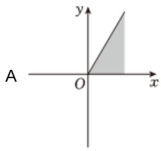
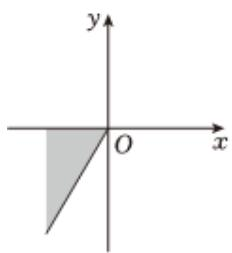
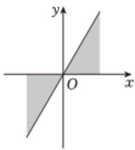
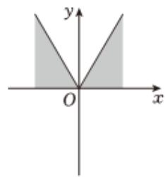

<!-- question-source:start -->
10、集合 $\{\alpha | k\pi \leqslant \alpha \leqslant k\pi + \frac{\pi}{3}, k \in Z\}$ 中的角所表示的范围（阴影部分）是（）

B  

C  

D  

<!-- question-source:end -->

![[Q00091845A1]]
