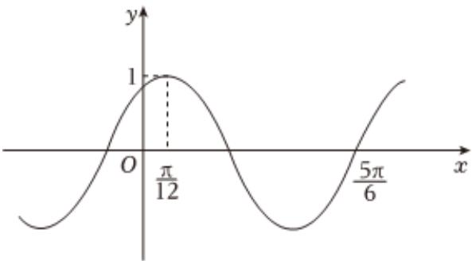

<!-- question-source:start -->
2、

函数 $f(x)=\cos(\omega x+\varphi)$ ( $\omega>0$ , $\left|\varphi\right|<\frac{\pi}{2}$ ) 的部分图象如图所示.

1 求 $f(x)$ 的解析式和单调递增区间；

2 若 $\alpha \in \left[-\frac{\pi}{3}, \frac{\pi}{12}\right]$ , $f(\alpha) = \frac{2}{3}$ , 求 $f(\alpha + \frac{\pi}{6})$ 的值.
<!-- question-source:end -->

![[Q00092373A1]]
