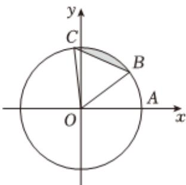

<!-- question-source:start -->
3、

单位圆O与x轴正半轴的交点为A，点B，C在圆O上，且点B在第一象限，点C在第二象限.

1 如图，当 $\widehat{BC}$ 的长为 $\frac{\pi}{3}$ 时，求线段BC与 $\widehat{BC}$ 所围成的弓形（阴影部分）面积；

2 记 $\angle AOC = \alpha, \alpha \in (\frac{\pi}{2}, \pi)$ ，当 $BO \perp CO$ ，点B的横坐标为 $\frac{4}{5}$ 时，求点C的坐标。

3 若将OB延长，取延长线上一点D（4，3）绕原点O逆时针旋转60°到点E的位置，求点E的坐标.
<!-- question-source:end -->

![[Q00092374A1]]
