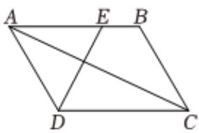

<!-- question-source:start -->
4、如图所示，在平行四边形ABCD中， $\overrightarrow{AE}=\frac{3}{4}\overrightarrow{AB}$ .记 $\overrightarrow{AD}=\overrightarrow{a}$ ， $\overrightarrow{AC}=\overrightarrow{b}$ .
(1)用向量 $\overrightarrow{a}$ ， $\overrightarrow{b}$ 表示向量 $\overrightarrow{AE}$ 和 $\overline{DE}$ ;

(2)若AD = AE = 3，且 $\overrightarrow{AC} \cdot \overrightarrow{DE} = \frac{11}{2}$ ，求cos < $\overrightarrow{a}$ ， $\overrightarrow{b} >$ .

<!-- question-source:end -->

![[Q00092375A1]]
