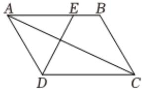

> [!faq]- 2024-2025学年内蒙古呼和浩特市回民区高一（下）期中数学试卷解析
>
> > [!success]- **【答案】** 详见解析
>
> > [!note]- **【解析】**
> > 详见解析
> >
> > $$
> > \overrightarrow {D E} = \overrightarrow {A E} - \overrightarrow {A D} = (- \frac {3}{4} \overrightarrow {a} + \frac {3}{4} \overrightarrow {b}) - \overrightarrow {a} = - \frac {7}{4} \overrightarrow {a} + \frac {3}{4} \overrightarrow {b}
> > $$
> >
> > (2)若AD = AE = 3，则AB = 4，由 $\overrightarrow{AC} = \overrightarrow{AB} + \overrightarrow{AD}$ ，
> >
> > 
> >
> > $$
> > \overrightarrow {D E} = \overrightarrow {A E} - \overrightarrow {A D} = \frac {3}{4} \overrightarrow {A B} - \overrightarrow {A D}
> > $$
> >
> > $$
> > \overrightarrow {A C} \bullet \overrightarrow {D E} = (\overrightarrow {A B} + \overrightarrow {A D}) \cdot (\frac {3}{4} \overrightarrow {A B} - \overrightarrow {A D}) = \frac {3}{4} | \overrightarrow {A B} | ^ {2} - \frac {1}{4} \overrightarrow {A B} \bullet \overrightarrow {A D} - | \overrightarrow {A D} | ^ {2} = \frac {1 1}{2}
> > $$
> >
> > 即 $\frac{3}{4} \times 16 - \frac{1}{4}\overrightarrow{AB} \bullet \overrightarrow{AD} - 9 = \frac{1\overrightarrow{1}}{2}$ ，解得 $\overrightarrow{AB} \bullet \overrightarrow{AD} = -10$
> >
> > $\left|\overrightarrow{b}\right| = \left|\overrightarrow{AC}\right| = \sqrt{\left(\overrightarrow{AB} + \overrightarrow{AD}\right)^2} = \sqrt{\left|\overrightarrow{AB}\right|^2 + 2\overrightarrow{AB} \bullet \overrightarrow{AD} + \left|\overrightarrow{AD}\right|^2} = \sqrt{16 - 20 + 9} = \sqrt{5},$ $\overrightarrow{a} \bullet \overrightarrow{b} = \overrightarrow{AD} \cdot (\overrightarrow{AB} + \overrightarrow{AD}) = \overrightarrow{AD} \bullet \overrightarrow{AB} + \left|\overrightarrow{AD}\right|^2 = -10 + 9 = -1,$
> >
> > $$
> > \cos <   \overrightarrow {a}, \overrightarrow {b} > = \frac {\overrightarrow {a} \bullet \overrightarrow {b}}{| \overrightarrow {a} | \bullet | \overrightarrow {b} |} = \frac {- 1}{3 \times \sqrt {5}} = - \frac {\sqrt {5}}{1 5}.
> > $$
