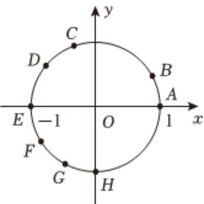

<!-- question-source:start -->
2、角 $\alpha$ 的始边与 $x$ 轴的非负半轴重合，终边与单位圆交于点 $P$ . 已知 $\tan \alpha > \sin \alpha > \cos \alpha$ . 则点 $P$ 可能位于如图所示单位圆的哪一段圆弧上（）

<!-- question-source:end -->

![[Q00092377A1]]
