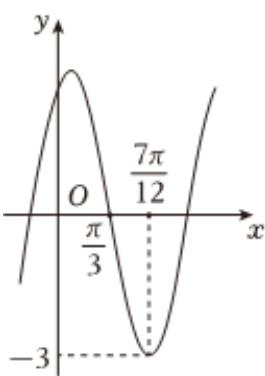

<!-- question-source:start -->
4、

已知函数 $f(x)=A\cos(\omega x+\varphi)(A>0,\omega>0,-\frac{\pi}{2}<\varphi<0)$ 的部分图象如图所示.

1 求 $f(x)$ 的解析式；

2 求 $f(x)$ 在 $[-\frac{\pi}{2}, 0]$ 上的值域；

3 若函数 $g(x) = 2f(x) - 3$ 在 $(0, m)$ 上恰有三个零点，求 $m$ 的取值范围.
<!-- question-source:end -->

![[Q00092393A1]]
