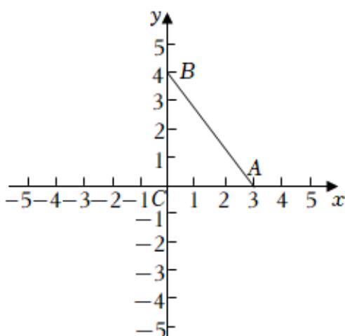

> [!faq]- 2024-2025学年内蒙古呼和浩特市赛罕区高一（下）期中数学试卷解析
>
> > [!success]- **【答案】** D
>
> > [!note]- **【解析】**
> > 在 $\triangle ABC$ 中， $AC=3$ ， $BC=4$ ， $\angle C=90^{\circ}$ ，
> >
> > 以 $C$ 为坐标原点， $CA$ ， $CB$ 所在的直线为 $\pmb{x}$ 轴， $\pmb{y}$ 轴建立平面直角坐标系，如图：
> >
> > 
> >
> > 则 $A(3,0), B(0,4), C(0,0)$
> >
> > 设 $P(x,y)$ ,
> >
> > 因为PC=1，
> >
> > 所以 $x^{2}+y^{2}=1$ ，
> >
> > 又 $\overrightarrow{PA} = (3 - x, - y)$ ， $\overrightarrow{PB} = (-x, 4 - y)$
> >
> > 所以 $\overrightarrow{PA} \bullet \overrightarrow{PB} = -x(3 - x) - y(4 - y) = x^2 + y^2 - 3x - 4y = -3x - 4y + 1$
> >
> > 设 $x=\cos\theta$ , $y=\sin\theta$ ,
> >
> > 所以 $\overrightarrow{PA} \bullet \overrightarrow{PB} = -3\cos \theta + 4\sin \theta + 1 = -5\sin (\theta + \varphi) + 1$ ，其中 $\tan \varphi = \frac{3}{4}$ ，
> >
> > 当 $\sin (\theta +\varphi) = 1$ 时， $\overrightarrow{PA}\bullet \overrightarrow{PB}$ 有最小值为-4，
> >
> > 当 $\sin (\theta +\varphi) = -1$ 时， $\overrightarrow{PA}\bullet \overrightarrow{PB}$ 有最大值为6，
> >
> > 所以 $\overrightarrow{PA} \bullet \overrightarrow{PB} \in [-4, 6]$
> >
> > 故选：D.
