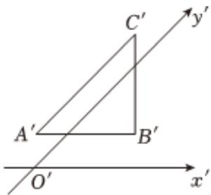

<!-- question-source:start -->
5、如图， $\triangle A'B'C'$ 是利用斜二测画法画出的 $\triangle ABC$ 的直观图，其中 $A'C' \parallel y'$ 轴， $A'B' \parallel x'$ 轴，且 $A'B' = B'C' = 1$ ，则 $\triangle ABC$ 的边 $BC = (\quad)$

A 1
B $\sqrt{2}$ C $\sqrt{3}$ D 3
<!-- question-source:end -->

![[Q00091862A1]]
