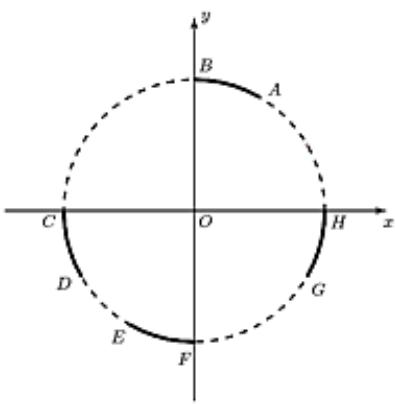

<!-- question-source:start -->
6、如图，在平面直角坐标系中， $\widehat{AB}$ 、 $\widehat{CD}$ 、 $\widehat{EF}$ 、 $\widehat{GH}$ 分别是单位圆上的四段弧，点P在其中一段上，角α以Ox为始边，OP为终边.若 $\sin\alpha < \cos\alpha < \tan\alpha$ ，则P所在的圆弧是（）
A $\widehat{AB}$ B $\widehat{CD}$ C $\widehat{EF}$ D $\widehat{GH}$

<!-- question-source:end -->

![[Q00091863A1]]
