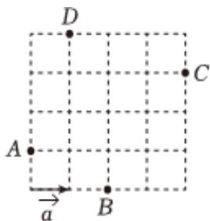

<!-- question-source:start -->
7、如图，网格纸上小正方形的边长为1.从A，B，C，D四点中任取两个点作为向量 $\overrightarrow{b}$ 的始点和终点，则 $\overrightarrow{a}\cdot\overrightarrow{b}$ 的最大值为（）
A 1
B 2
C 4
D $2\sqrt{5}$

<!-- question-source:end -->

![[Q00091864A1]]
