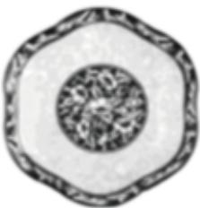
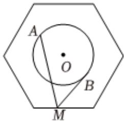

<!-- question-source:start -->
8、青花瓷(blueandwhiteporcelain)，又称白地青花瓷，常简称青花，是中国瓷器的主流品种之一，属釉

下彩瓷.原始青花瓷于唐宋已见端倪，成熟的青花瓷则出现在元代景德镇的湖田窑，图一是一个由波涛纹和葡萄纹构成的正六边形青花瓷盘，已知图二中正六边形的边长为2，圆O的圆心为正六边形的中心，半径为1，若点M在正六边形的边上运动，动点A，B在圆O上运动且关于圆心O对称，则 $\overrightarrow{MA} \cdot \overrightarrow{MB}$ 的最小值是（）

  
图一  
图二

A $\frac{3}{2}$ B 2
C $\frac{5}{2}$ D 3
<!-- question-source:end -->

![[Q00091865A1]]
