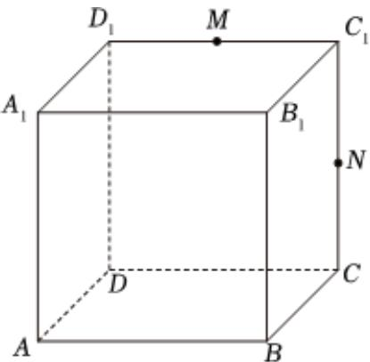

<!-- question-source:start -->
2、如图，在棱长为1的正方体 $ABCD-A_{1}B_{1}C_{1}D_{1}$ 中，M，N分别为棱 $C_{1}D_{1}$ ， $C_{1}C$ 的中点，则（）

A 直线BN与 $MB_{1}$ 是相交直线
B 直线MN与AC所成的角是 $\frac{\pi}{3}$ C 直线MN//平面 $ACD_{1}$

D BM⊥DN
<!-- question-source:end -->

![[Q00091867A1]]
