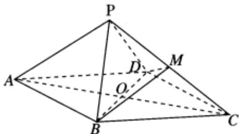

<!-- question-source:start -->
4. 如图所示，四边形ABCD为菱形，AB=2， $\angle BAD=60^{\circ}$ ，将 $\triangle ABD$ 沿BD折起（折起后A到P的位置），设 $PA=\sqrt{3}$ ，点M是线段PC的中点.

1 证明： $PA \parallel$ 平面MBD；

2 证明：平面PAC⊥平面MBD；

3 求三棱锥M-PBD的体积.
<!-- question-source:end -->

![[Q00091875A1]]
