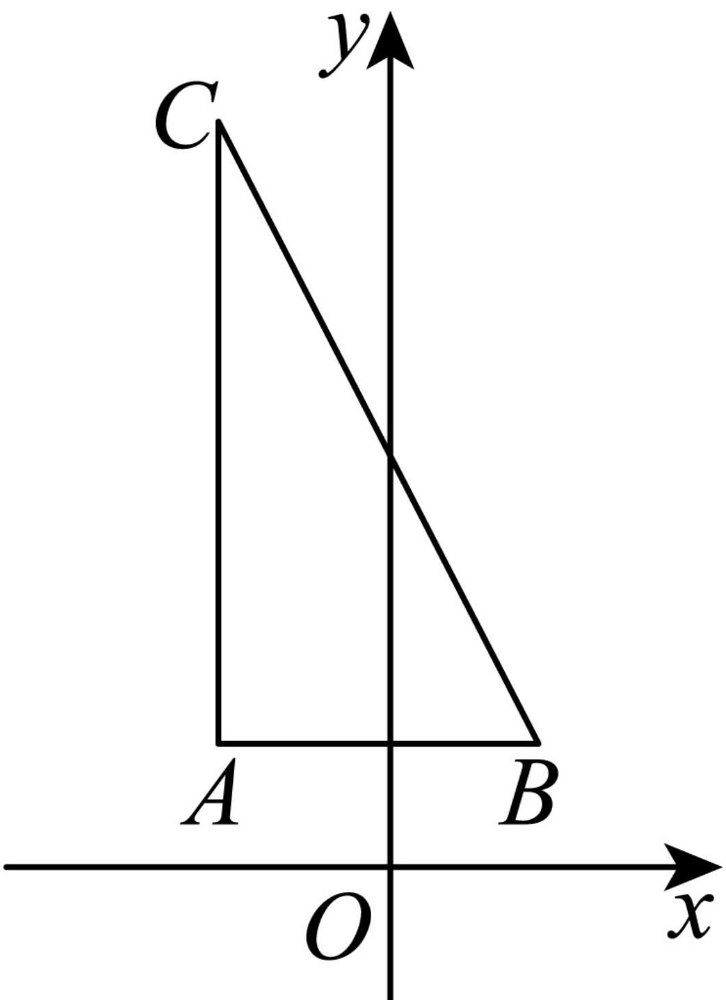

> [!faq]- 2024-2025学年内蒙古呼和浩特市高一（下）期末数学试卷解析
>
> > [!success]- **【答案】** D
>
> > [!note]- **【解析】**
> > 根据题意，直观图 $\triangle A'B'C'$ 中， $A'C''\parallel y'$ 轴， $A'B''\parallel x'$ 轴，且 $A'B' = B'C' = 1$ ，由斜二测画法，还原后 $\triangle ABC$ 如下：
> >
> > 
> >
> > 其中 $AC \perp AB$ ，且 $AB = A'B' = 1$ ， $AC = 2A'C' = 2\sqrt{2}$ ，
> >
> > 则 $BC = \sqrt{(2\sqrt{2})^2 + 1^2} = 3.$
> >
> > 故选：D.
