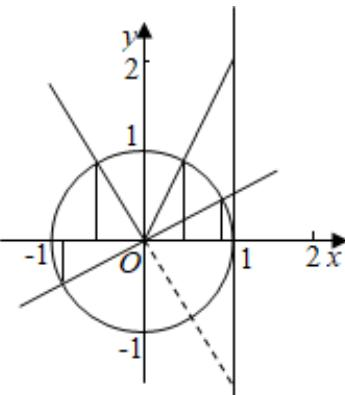

> [!faq]- 2024-2025学年内蒙古呼和浩特市高一（下）期末数学试卷解析
>
> > [!success]- **【答案】** C
>
> > [!note]- **【解析】**
> > 若 $P$ 在 $AB$ 段，正弦大于余弦， $\sin \alpha <  \cos \alpha <  \tan \alpha$ 不成立；
> >
> > 若 $P$ 在 $CD$ 段，正切最大，余弦最小，则 $\sin \alpha < \cos \alpha < \tan \alpha$ 不成立；
> >
> > 若 $P$ 在 $EF$ 段，正切最大，正弦最小， $\sin \alpha <  \cos \alpha <  \tan \alpha$ 成立；
> >
> > 若 $P$ 在 $GH$ 段，余弦为正值，正弦和正切为负值， $\sin \alpha < \cos \alpha < \tan \alpha$ 不成立.
> >
> > ∴ P 所在的圆弧最有可能的是 $\widehat{EF}$ .
> >
> > 故选：C.
> >
> > 
