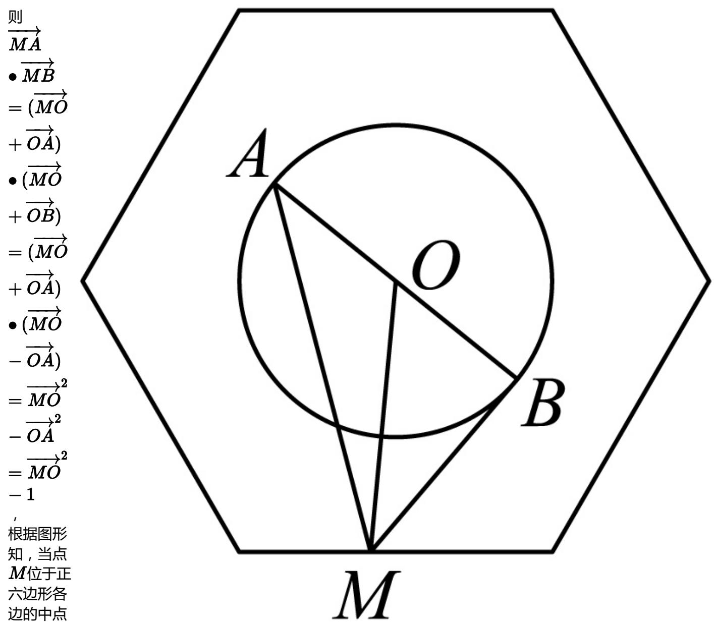

> [!faq]- 2024-2025学年内蒙古呼和浩特市高一（下）期末数学试卷解析
>
> > [!success]- **【答案】** B
>
> > [!note]- **【解析】**
> > 已知正六边形的边长为2，圆O的圆心为正六边形的中心，半径为1，
> > 又点M在正六边形的边上运动，动点A，B在圆O上运动且关于圆心O对称，连接AB，OM，如图，
> >
> > 
> >
> > 时，此时 $|MO|$ 最小值为 $\sqrt{3}$ ， $|\overrightarrow{MO}|^2 - 1$ 的最小值为2，
> >
> > 所以 $\overrightarrow{MA} \cdot \overrightarrow{MB}$ 的最小值是2.
> >
> > 故选：B.
