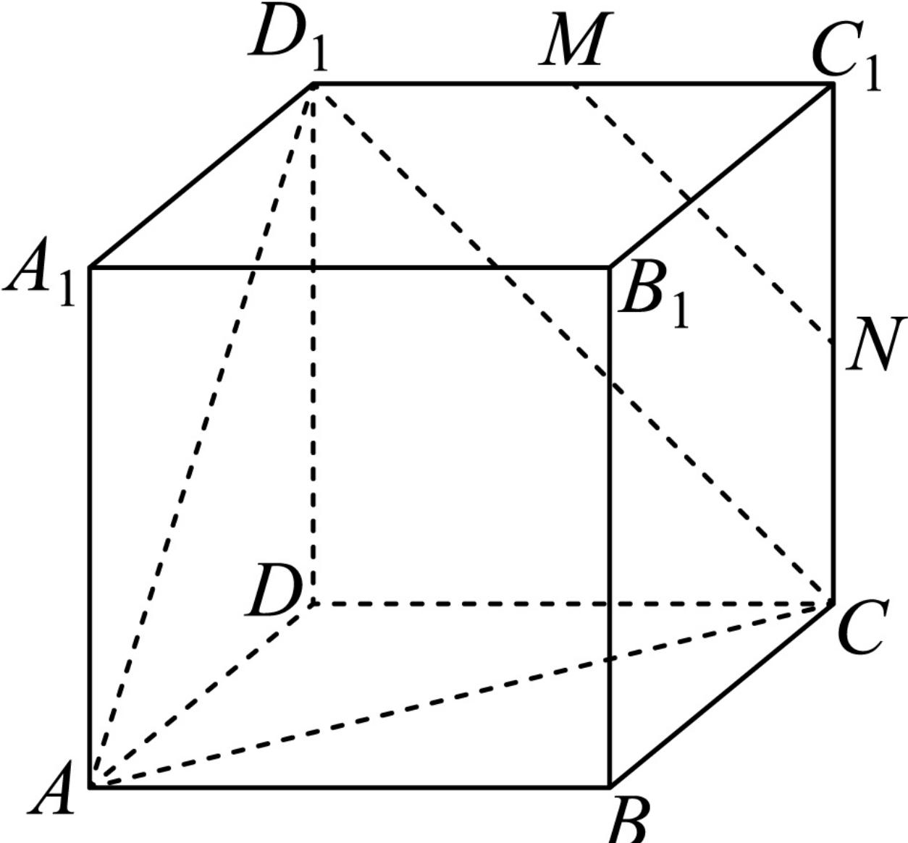
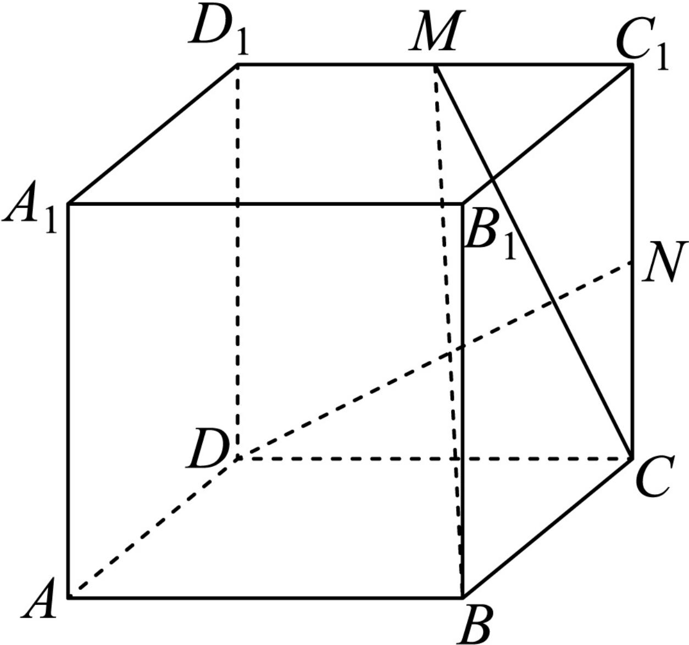

> [!faq]- 2024-2025学年内蒙古呼和浩特市高一（下）期末数学试卷解析
>
> > [!success]- **【答案】** BCD
>
> > [!note]- **【解析】**
> > 对于 $A$ ，根据异面直线的判定定理可知 $BN$ 与 $MB_{1}$ 是异面直线，所以 $A$ 选项错误；
> >
> > 对于 $B$ ，如图，连接 $CD_{1}$ ，根据题意易得 $MN / / CD_{1}$
> >
> > 所以直线MN与AC所成的角即为直线 $CD_{1}$ 与AC所成的角，
> >
> > 又 $\triangle ACD_{1}$ 是等边三角形，所以直线 $MN$ 与 $AC$ 所成的角是 $\frac{\pi}{3}$ ，所以 $B$ 选项正确；
> >
> > 
> >
> > 对于 $C$ ，易知 $MN \parallel CD_{1}$ ， $CD_{1} \subset$ 平面 $ACD_{1}$ ， $MN \notin$ 平面 $ACD_{1}$
> >
> > 所以 $MN \parallel$ 平面 $ACD_{1}$ ，所以 $C$ 选项正确；
> >
> > 对于 $D$ ，连接 $MC$ ， $MB$ ， $DN$ ，因为 $DC = CC_{1}$ ， $\angle DCN = \angle CC_1M$ ， $NC = MC_1$
> >
> > 所以 $\triangle DCN\cong \triangle CC_1M$
> >
> > 所以 $\angle CDN + \angle DCM = \angle C_1CM + \angle DCM = 90^\circ$ ，所以 $DN\bot CM$ 又 $BC \perp$ 平面 $DCC_{1}D_{1}$ ， $DN \subset$ 平面 $DCC_{1}D_{1}$ ，所以 $BC \perp DN$ ，
> > 又 $BC \cap CM = C$
> >
> > 所以 $DN \perp$ 面BCM，所以 $DN \perp BM$ ，所以D选项正确.
> >
> > 
> >
> > 故选：BCD.
