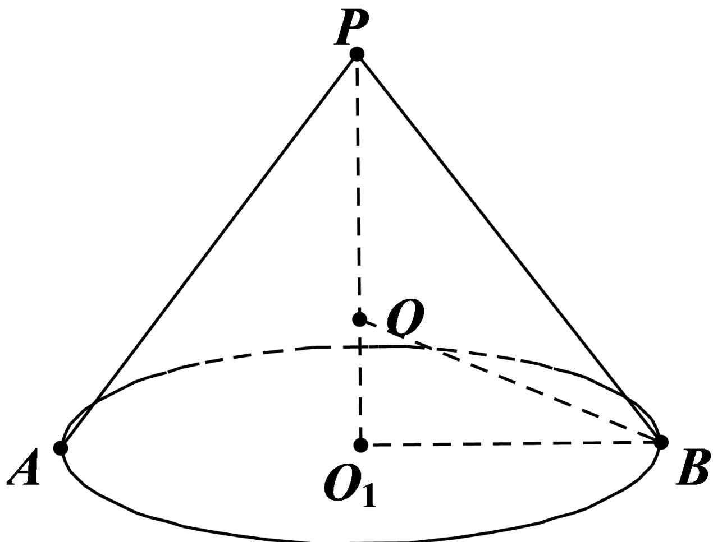

> [!faq]- 2024-2025学年内蒙古呼和浩特市高一（下）期末数学试卷解析
>
> > [!success]- **【答案】** $48\pi$
>
> > [!note]- **【解析】**
> > 圆锥的底面半径为3，侧面积为 $18\pi$ ，
> >
> > 设圆锥的母线长为 $l$ ，高为 $h$ ，由侧面积为 $18\pi$ ，可得 $3\pi l = 18\pi$ ，得到 $l = 6$
> >
> > 
> >
> > 如图， $O_{1}B = 3$ ，则 $h = \sqrt{l^2 - O_1B^2} = \sqrt{36 - 9} = 3\sqrt{3}$
> >
> > 易知圆锥外接球的球心O在 $O_{1}P$ 上，设圆锥外接球的半径为R，
> >
> > 则 $R = OB = \sqrt{O_1O^2 + O_1B^2} = \sqrt{(3\sqrt{3} - R)^2 + 3^2}$ ，解得 $R = 2\sqrt{3}$
> >
> > 所以圆锥外接球的表面积为 $S = 4\pi R^2 = 4\pi \times (2\sqrt{3})^2 = 48\pi$
> >
> > 故答案为： $48\pi$
