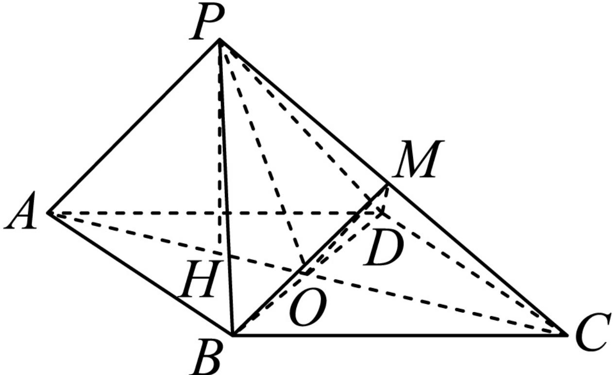

> [!faq]- 2024-2025学年内蒙古呼和浩特市高一（下）期末数学试卷解析
>
> > [!success]- **【答案】** 详见解析
>
> > [!note]- **【解析】**
> > 详见解析
> >
> > (1) 证明：连接 $OM$ ，
> >
> > 因为O，M分别是AC，PC的中点，因此OM//PA，
> >
> > 又因为 $OM \subset$ 平面 $MBD$ , $PA \notin MBD$ , 因此 $PA \parallel$ 面 $MBD$ .
> >
> > (2)证明：连接OP，
> >
> > 在菱形ABCD中， $\angle BAD = 60^{\circ}$ ，所以 $\triangle BAD$ 和 $\triangle BPD$ 是等边三角形，
> >
> > 所以 $BD \perp AC$ ， $BD \perp OP$
> >
> > 又 $AC \cap OP = O$ ， $AC$ ， $OP \subset$ 面 $PAC$ ，所以 $BD \perp$ 平面 $PAC$ 又 $BD \subset$ 面 $MBD$ ，所以平面 $PAC \perp$ 平面 $MBD$ .
> >
> > (3)过点P作PH⊥AC，
> >
> > 由（2）知， $BD \perp$ 平面PAC，又PH⊂面PAC，因此 $BD \perp PH$ ，
> >
> > 又 $BD \cap AC = O, BD, AC \subset$ 面ABCD，所以 $PH \perp$ 面ABCD，
> >
> > 因为 $AB = 2$ ， $\angle BAD = 60^{\circ}$ ，所以 $OP = OA = \sqrt{3}$
> >
> > 又 $AP = \sqrt{3}$ ，所以三角形APO为等边三角形，所以PH= $\frac{3}{2}$
> >
> > 又 $S_{\triangle BCD} = \frac{1}{2}\times 2\times 2sin60^{\circ} = \sqrt{3}$
> >
> > $$
> > V _ {M - P B D} = V _ {M - C B D} = \frac {1}{2} V _ {P - C B D} = \frac {1}{2} \times \frac {1}{3} S _ {\triangle B C D} \times P H = \frac {\sqrt {3}}{4}.
> > $$
> >
> > 
