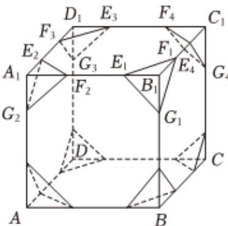

<!-- question-source:start -->
3、半正多面体是由两种或两种以上的正多边形围成的多面体.半正多面体体现了数学的对称美.按照以下方式可构造一个半正多面体：如图1，在一个棱长为4的正方体中， $B_{1}E_{1}=B_{1}F_{1}=B_{1}G_{1}=a$ ， $A_{1}E_{2}=A_{1}F_{2}=A_{1}G_{2}=a$ ， $\ldots$ ， $a\in(0,4)$ ，过 $E_{1}F_{1}G_{1}$ 三点可作一截面，类似地，可作8个形状完全相同的截面.关于该几何体，下列说法正确的是（）

A 当 $a = 1$ 时，该几何体是一个半正多面体

B 若该几何体是由正八边形与正三角形围成的半正多面体，则边长为 $4 - 2\sqrt{2}$

C 若该几何体是由正方形与正三角形围成的半正多面体，则体积为 $\frac{160}{3}$

D 该几何体可能是由正方形与正六边形围成的半正多面体
<!-- question-source:end -->

![[Q00090956A1]]
