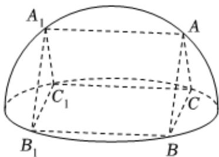

<!-- question-source:start -->
3、

如图一个半球，挖掉一个内接直三棱柱 $ABC-A_{1}B_{1}C_{1}$ （棱柱各顶点均在半球面上），AB=AC，棱柱侧面 $BB_{1}C_{1}C$ 是一个长为4的正方形.

1 求挖掉的直三棱柱的体积；

2 求剩余几何体的表面积.
<!-- question-source:end -->

![[Q00090962A1]]
