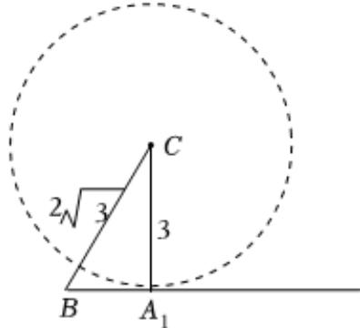

> [!faq]- 2024-2025学年内蒙古巴彦淖尔一中高一（下）期中数学试卷解析
>
> > [!success]- **【答案】** AC
>
> > [!note]- **【解析】**
> > $A$ 选项中， $\sin^2 A + \sin^2 B + \cos^2 C <   1$ ，则 $\sin^2 A + \sin^2 B <   \sin^2 C$
> >
> > 由正弦定理可得 $a^2 + b^2 < c^2$ ，再由余弦定理可得 $\cos C = \frac{a^2 + b^2 - c^2}{2ab} < 0$
> >
> > 故角 $C$ 为钝角，故 $\mathbf{A}$ 正确；
> >
> > B选项中，A， $B \in (0, \pi)$ ，则2A， $2B \in (0, 2\pi)$ ，
> >
> > 由 $\sin 2A = \sin 2B$ 可得 $2A = 2B$ 或 $2A + 2B = \pi$ ，即 $A = B$ 或 $A + B = \frac{\pi}{2}$ ，即 $\triangle ABC$ 为等腰三角形或直角三角形，故 $B$ 错误；
> >
> > $C$ 选项中，锐角 $\triangle ABC$ 中， $A + B > \frac{\pi}{2}$ ，可得 $\frac{\pi}{2} >A > \frac{\pi}{2} -B > 0$
> >
> > 则 $\sin A > \sin\left(\frac{\pi}{2} - B\right) = \cos B$ ，故C正确；
> >
> > D选项中，由图可知，
> >
> > 
> >
> > 欲使 $\triangle ABC$ 有两解，则 $b\in(3,2\sqrt{3})$ ，故 $D$ 错误.
> >
> > 故选：AC.
