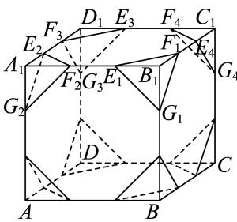
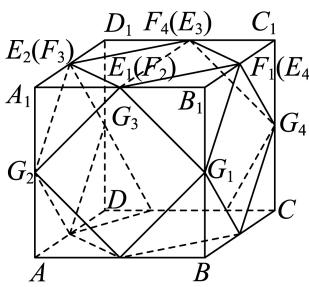
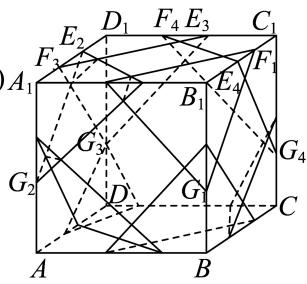

> [!faq]- 2024-2025学年内蒙古巴彦淖尔一中高一（下）期中数学试卷解析
>
> > [!success]- **【答案】** CD
>
> > [!note]- **【解析】**
> > 选项A：当a=1时， $E_{1}F_{1}=\sqrt{2}$ ，但 $E_{1}F_{2}=2$ ，
> >
> > 所以该几何体不满足半正多面体的定义，故 $A$ 错误；
> >
> > 选项B：如图1，因为棱长为4的正方体中，
> >
> > $$
> > B _ {1} E _ {1} = B _ {1} F _ {1} = B _ {1} G _ {1} = a, A _ {1} E _ {2} = A _ {1} F _ {2} = A _ {1} G _ {2} = a, \dots , a \in (0, 4)
> > $$
> >
> > 所以 $E_{1}G_{1} = \sqrt{2} a,E_{1}F_{2} = 4 - 2a$
> >
> > 当此半正多面体是由正八边形与正三角形围成时，
> >
> > $\sqrt{2} a = 4 - 2a$ ，解得 $a = 4 - 2\sqrt{2}$
> >
> > 所以半正多面体的边长为 $\sqrt{2} a = 4\sqrt{2} - 4$ ，所以 $B$ 选项错误；
> >
> > 选项C，如图2，当此半正多面体是由正方形与正三角形围成时， $E_{1}F_{2}=4-2a=0$ ，
> > 所以a=2，所以该半正多面体的体积为 $4\times4\times4-\frac{1}{3}\times\frac{1}{2}\times2\times2\times2\times8=\frac{160}{3}$ ，故C正确；
> > 选项D，当a=3时，如图3所示，此半正多面体是由正方形与正六边形围成，
> >
> > 此时该几何体是半正多面体，故 $D$ 正确.
> >
> > 故选：CD.
> >
> >   
> > 图1
> >
> >   
> > 图2
> >
> >   
> > 图3
