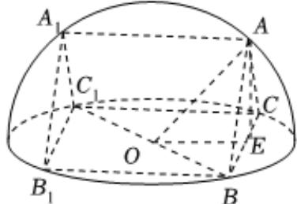

> [!faq]- 2024-2025学年内蒙古巴彦淖尔一中高一（下）期中数学试卷解析
>
> > [!success]- **【答案】** 详见解析
>
> > [!note]- **【解析】**
> > 详见解析
> >
> > (1) 记球心为 $O, BC$ 中点为 $\pmb{E}$ , 连接 $AO, OE, AE$ ,
> >
> > 
> >
> > 由球的性质知 $BC$ 是 $\triangle ABC$ 所在小圆直径，又 $B_{1}BC_{1}C$ 是一个长为4的正方形，因此 $OE = AE = 2$ ，球半径为 $R = AO = \sqrt{AE^2 + OE^2} = 2\sqrt{2}$ 挖掉的直三棱柱的体积 $V = S_{\triangle ABC} \bullet BB_{1} = \frac{1}{2} \times 4 \times 2 \times 4 = 16$
> >
> > (2)由（1）知
> >
> > $$
> > A C = \sqrt {A E ^ {2} + E C ^ {2}} = 2 \sqrt {2}, S _ {A C C _ {1} A _ {1}} = S _ {A B B _ {1} A _ {1}} = 2 \sqrt {2} \times 4 = 8 \sqrt {2}, S _ {\triangle A B C} = \frac {1}{2} \times 4 \times 2
> > $$
> >
> > $$
> > = 4, S _ {B C C _ {1} B _ {1}} = 1 6, S _ {\text {半球表面积}} = 2 \pi \times (2 \sqrt {2}) ^ {2} + \pi \times (2 \sqrt {2}) ^ {2} = 2 4 \pi
> > $$
> >
> > 所以剩余几何体表面积为：
> >
> > $$
> > \begin{array}{r l} & {{S = S _ {\mathrm{半球表面积}} - S _ {B C C _ {1} B _ {1}} + S _ {A A _ {1} C _ {1} C} + S _ {A B B _ {1} A _ {1}} + 2 S _ {\triangle A B C} = 2 4 \pi - 1 6 + 2 \times 8 \sqrt {2} + 2 \times 4}} \\ & {{= 2 4 \pi + 1 6 \sqrt {2} - 8}} \end{array}
> > $$
