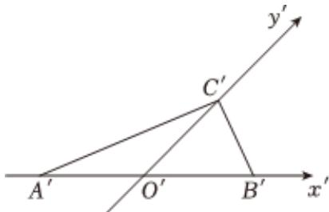

<!-- question-source:start -->
3、如图， $\triangle ABC$ 斜二测画法的直观图是 $\triangle A'B'C'$ ， $\triangle A'B'C'$ 的面积为

6，那么 $\triangle ABC$ 的面积为（）

A $12\sqrt{2}$ B $24\sqrt{2}$ C $\frac{3\sqrt{2}}{2}$ D $3\sqrt{2}$
<!-- question-source:end -->

![[Q00090929A1]]
