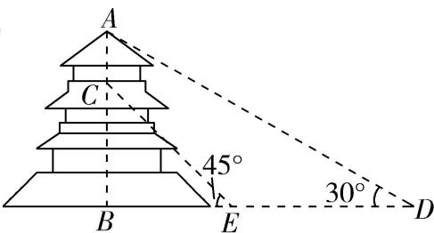

<!-- question-source:start -->
7、“欲穷千里目，更上一层楼”出自唐朝诗人王之涣的《登鹳雀楼》，鹳雀楼位于今山西永济市，该楼有三层，前对中条山，下临黄河，传说常有鹳雀在此停留，故有此名。与黄鹤楼、岳阳楼、滕王阁齐名，是中国古代四大名楼之一。下面是复建的鹳雀楼的示意图，某位游客（身高忽略不计）从地面D点看楼顶点A的仰角为30°，沿直线前进80米到达E点，此时看点C的仰角为45°，若BC=3AC，则楼高AB约为（） $\sqrt{3}\approx1.732$ ，结果保留2位小数）
A 80.56米
B 81.46米
C 84.32米
D 86.56米

<!-- question-source:end -->

![[Q00090933A1]]
