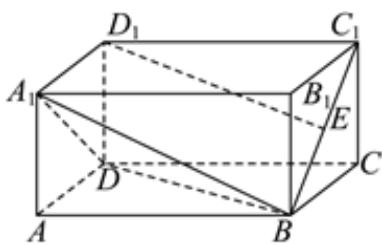

<!-- question-source:start -->
1、下列说法正确的是（）
A 若 $|\overrightarrow{a}| > |\overrightarrow{b}|$ ，则 $\overrightarrow{a} > \overrightarrow{b}$ B 若 $\overrightarrow{a} = \overrightarrow{b}$ ，则 $\overrightarrow{a} // \overrightarrow{b}$ C 若 $\overrightarrow{a} // \overrightarrow{b}, \overrightarrow{b} // \overrightarrow{c}$ ，则 $\overrightarrow{a} // \overrightarrow{c}$ D 若 $\overrightarrow{a} = \overrightarrow{b}, \overrightarrow{b} = \overrightarrow{c}$ ，则 $\overrightarrow{a} = \overrightarrow{c}$

<!-- question-source:end -->

![[Q00090935A1]]
