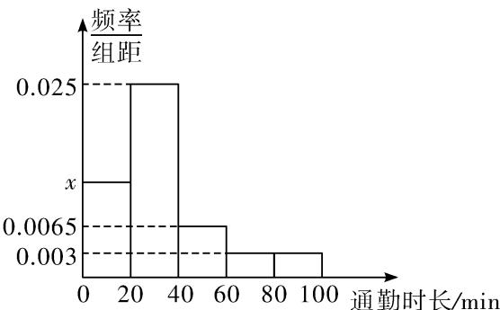

<!-- question-source:start -->
3、随着城市化进程的加速，通勤时间的长短直接影响到城市居民的生活质量。某调查研究机构随机采访了某市部分人群的通勤时长，共收到1000份调查回复，将所得数据绘制成如图所示的频率分布直方图，则（）
A 在参与调查的人群中，通勤时长超过60分钟的人数为100人
B 估计该市居民通勤时长不超过20分钟的人数约占25%
C 估计该市居民通勤平均时长约为35分钟
D 估计该市居民通勤时长的中位数约为30分钟

<!-- question-source:end -->

![[Q00090937A1]]
