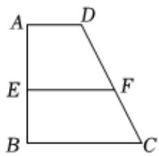
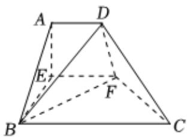

<!-- question-source:start -->
5、

已知如图甲，在梯形ABCD中， $AD \parallel BC$ ， $\angle ABC = \angle BAD = \frac{\pi}{2}$ , AB = BC = 2AD = 4, E
, F分别是AB, CD的中点, $EF \parallel BC$ , 沿EF将梯形ABCD翻折，使平面AEFD⊥平面EBCF(如图乙)。

1 证明： $EF \perp$ 平面ABE；

2 求点 $E$ 到平面 $ABF$ 的距离；

3 求二面角 $D - BF - E$ 的正切值.

  
甲

  
乙
<!-- question-source:end -->

![[Q00090945A1]]
