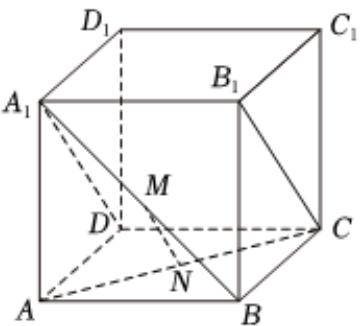

<!-- question-source:start -->
3. 如图，在正方体 $ABCD - A_{1}B_{1}C_{1}D_{1}$ 中， $M$ 、 $N$ 分别为 $A_{1}B$ 、 $AC$ 的中点.

1 证明： $MN \parallel$ 平面 $BCC_{1}B_{1}$ ;

2 求 $A_{1}B$ 与平面 $A_{1}B_{1}CD$ 所成角的大小.
<!-- question-source:end -->

![[Q00092396A1]]
