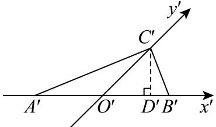
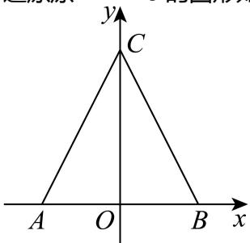

> [!faq]- 2024-2025学年内蒙古巴彦淖尔一中高一（下）第四次诊断数学试卷解析
>
> > [!success]- **【答案】** A
>
> > [!note]- **【解析】**
> > 设 $O^{\prime}C^{\prime}=h$ ，过点 $C^{\prime}$ 作 $C^{\prime}D^{\prime}\perp x^{\prime}$ 轴，垂足为点 $D^{\prime}$ ，设 $A^{\prime}B^{\prime}=a$ ，如下图所示：
> >
> > 
> >
> > 则 $C^{\prime}D^{\prime}=h\sin45^{\circ}=\frac{\sqrt{2}}{2}h$ ，故 $S_{\triangle A^{\prime}B^{\prime}C^{\prime}}=\frac{1}{2}a\bullet C^{\prime}D^{\prime}=\frac{1}{2}a\bullet\frac{\sqrt{2}}{2}h=\frac{\sqrt{2}}{4}ah=6$ ，可得 $ah=12\sqrt{2}$ ，
> >
> > 还原原 $\triangle ABC$ 的图形如下图所示，则 $AB=a,OC=2h$ ，
> >
> > 
> >
> > 故 $S_{\triangle ABC}=\frac{1}{2}AB\bullet OC=\frac{1}{2}a\bullet2h=ah=12\sqrt{2}.$
> >
> > 故选：A.
