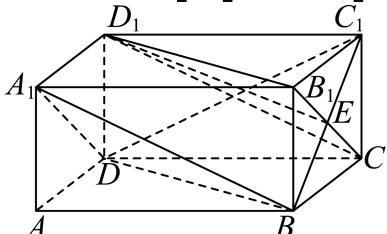

> [!faq]- 2024-2025学年内蒙古巴彦淖尔一中高一（下）第四次诊断数学试卷解析
>
> > [!success]- **【答案】** ACD
>
> > [!note]- **【解析】**
> > 易知平面 $CB_{1}D_{1} //$ 平面 $A_{1}BD$ ，从而可得 $ED_{1} //$ 平面 $A_{1}BD$ ， $A$ 正确；
> >
> > 
> >
> > 易知 $BD = DC_{1} = \sqrt{5}$ ， $\triangle BDC_{1}$ 为等腰三角形， $BC_{1}$ 为底边，
> >
> > 所以 $BC_{1}$ 与 $BD$ 不垂直，所以 $BC_{1}$ 与平面 $A_{1}BD$ 不垂直， $B$ 错误；
> >
> > 因为 $ED_{1}$ // 平面 $A_{1}BD$ 知，
> >
> > 所以 $V_{E-A_{1}BD}=V_{D_{1}-A_{1}BD}=V_{B-A_{1}D_{1}D}=\frac{1}{3}\times\frac{1}{2}\times1\times1\times2=\frac{1}{3},C$ 正确；
> >
> > 因为经过 $AB$ 的截面为矩形，截面与侧面 $BCC_{1}B_{1}$ 的交线最长为对角线 $BC_{1}$
> >
> > 所以截面面积的最大值为 $AB \times BC_{1} = 2\sqrt{2}$ ， $D$ 正确.
> >
> > 故选：ACD.
