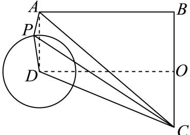

> [!faq]- 2024-2025学年内蒙古巴彦淖尔一中高一（下）第四次诊断数学试卷解析
>
> > [!success]- **【答案】** $32\pi$
>
> > [!note]- **【解析】**
> > 因为三棱锥 $P - ABC$ 的底面 $ABC$ 是等腰直角三角形，且 $\angle ABC = 90^{\circ}$
> >
> > $$
> > A B = B C = 4. P A = 2 \sqrt {2}, P B = P C
> > $$
> >
> > 所以 $P$ 在 $BC$ 的中垂面上，
> >
> > 所以 $P$ 的轨迹为 $BC$ 中垂面与以 $A$ 为球心， $2\sqrt{2}$ 为半径的球的交线，
> >
> > 即 $P$ 的轨迹为如图以 $D$ 为圆心，2为半径的圆，且 $O$ 是 $BC$ 的中点，如图所示，
> >
> > 
> >
> > 因为 $\angle ABC = 90^{\circ}$ ， $AB = BC = 4$ ，所以由勾股定理得 $AC = 4\sqrt{2}$
> >
> > 由三角形面积公式得 $S_{\triangle ABC} = \frac{1}{2} \times 4 \times 4 = 8$ ，
> >
> > 若三棱锥体积最大，则 $P$ 到面ABC的距离最大即可，此时 $P$ 在最上面，
> >
> > 易得 $PD = 2$ ， $AB = BC = DO = 4$ ， $CO = 2$
> >
> > 且由勾股定理得 $CD = 2\sqrt{5}$ ，此时 $PC = \sqrt{24}$ ，
> >
> > 则 $PC^2 + PA^2 = 32 = AC^2$ ，即 $AP \perp PC$
> >
> > 得到外接球球心为AC的中点，即球的半径为 $2\sqrt{2}$ ，
> >
> > 由球的表面积公式得球的表面积为 $(2\sqrt{2})^2\times 4\pi = 32\pi .$
> >
> > 故答案为： $32\pi$
