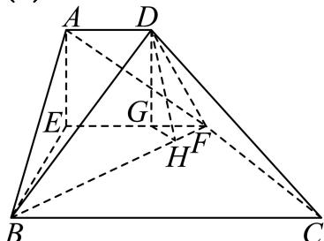

> [!faq]- 2024-2025学年内蒙古巴彦淖尔一中高一（下）第四次诊断数学试卷解析
>
> > [!success]- **【答案】** 详见解析
>
> > [!note]- **【解析】**
> > 详见解析
> >
> > (1) 证明：在直角梯形ABCD中，因为 $\angle ABC = \angle BAD = \frac{\pi}{2}$ ，故 $AB \perp AD, AB \perp BC$ .
> >
> > 又E，F分别是AB，CD的中点，所以EF//BC，所以EF⊥AB.
> >
> > 所以在折叠后的几何体中，有 $EF \perp AE$ ， $EF \perp BE$ ，
> >
> > $AE \cap BE = E, AE, BE \subset$ 平面ABE,
> >
> > 所以EF⊥平面ABE.
> >
> > (2)如图：
> >
> > 
> >
> > 因为平面 $AEFD \perp$ 平面 $EBCF$ ，平面 $AEFD \cap$ 平面 $EBCF = EF$ ， $AE \subset$ 平面 $AEFD$ ， $AE \perp EF$ ，所以 $AE \perp$ 平面 $EBCF$ .
> >
> > 因为BE⊂平面EBCF，所以AE⊥BE，
> >
> > 所以 $EA$ ， $EB$ ， $EF$ 两两垂直，且 $EA = EB = 2$ ， $EF = 3$
> >
> > 所以 $\triangle ABF$ 中， $AB = \sqrt{AE^2 + BE^2} = \sqrt{2^2 + 2^2} = 2\sqrt{2}, FA = FB = \sqrt{4 + 9} = \sqrt{13}.$
> >
> > 所以 $S_{\triangle ABF} = \frac{1}{2}\times 2\sqrt{2}\times \sqrt{13 - 2} = \sqrt{22}.$
> >
> > $$
> > V _ {A - B E F} = \frac {1}{3} S _ {\triangle B E F} \bullet E A = \frac {1}{3} \times \frac {1}{2} \times 2 \times 3 \times 2 = 2.
> > $$
> >
> > 设点E到平面ABF的距离为h，
> >
> > 则 $V_{A-BEF}=V_{E-ABF}$ ，
> >
> > 所以 $\frac{1}{3} S_{\triangle ABF}\bullet h = 2$
> >
> > 解得 $h = \frac{6}{\sqrt{22}} = \frac{3\sqrt{22}}{11}$ .
> >
> > 即点E到平面ABF的距离为 $\frac{3\sqrt{22}}{11}$ .
> >
> > (3)过D作DG⊥EF于点G，过G作GH⊥BF于点H，连接DH.
> >
> > 因为平面AEFD⊥平面EBCF，所以DG⊥平面BCFE，BF⊂平面BCFE
> >
> > 所以 $DG \perp BF$ ，又 $GH \perp BF$ ，DG，GH是平面DGH内的两条相交直线，
> >
> > 所以BF⊥平面DGH，
> >
> > 所以 $\angle DHG$ 即为二面角 $D - BF - E$ 的平面角.
> >
> > 因为 $\triangle FHG\sim \triangle FEB$
> >
> > 所以 $\frac{FG}{FB} = \frac{HG}{EB}$
> >
> > 解得 $HG = \frac{1\times 2}{\sqrt{13}} = \frac{2\sqrt{13}}{13}$
> >
> > 在 $Rt\triangle DGH$ 中， $\tan \angle DHG = \frac{DG}{GH} = \frac{2}{\frac{2\sqrt{13}}{13}} = \sqrt{13}.$
> >
> > 即二面角 $D - BF - E$ 的正切值为 $\sqrt{13}$ .
