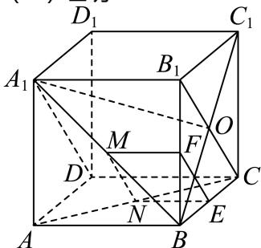

> [!faq]- 2024-2025学年内蒙古巴彦淖尔一中高一（下）第四次诊断数学试卷解析
>
> > [!success]- **【答案】** 详见解析
>
> > [!note]- **【解析】**
> > 详见解析
> >
> > (1) 证明：
> >
> > 
> >
> > 在正方体 $ABCD - A_1B_1C_1D_1$ 中，分别取 $BC$ ， $BB_{1}$ 的中点 $E$ ， $F$ ，连接因为 $M$ 、 $N$ 分别为 $A_{1}B$ 、 $AC$ 的中点，所以 $MF \parallel A_{1}B_{1}$ ，且 $MF = \frac{1}{2} A_{1}B_{1}, NE \parallel AB$ 且 $NE = \frac{1}{2} AB$ ，又因为 $AB \parallel A_{1}B_{1}$ 且 $AB = A_{1}B_{1}$ ，所以 $MF \parallel NE$ 且 $MF = NE$ ，即四边形 $MNEF$ 是平行四边形，故 $MN \parallel EF$ ，因为 $MN \notin$ 平面 $BCC_{1}B_{1}$ ， $EF \subset$ 平面 $BCC_{1}B_{1}$ ，所以 $MN \parallel$ 平面 $BCC_{1}B_{1}$ （2）连接 $BC_{1}$ ，交 $B_{1}C$ 于点 $O$ ，连接 $A_{1}O$ ，因为 $A_{1}B_{1} \perp$ 平面 $BCC_{1}B_{1}$ ， $BC_{1} \subset$ 平面 $BCC_{1}B_{1}$ ，故 $A_{1}B_{1} \perp BC_{1}$ 又因为四边形 $BCC_{1}B_{1}$ 是正方形，则 $BC_{1} \perp B_{1}C$ 而 $A_{1}B_{1} \cap B_{1}C = B_{1}$ ，且 $A_{1}B_{1}$ ， $B_{1}C \subset$ 平面 $A_{1}B_{1}CD$ 故 $BC_{1} \perp$ 平面 $A_{1}B_{1}CD$ 所以 $\angle OA_{1}B$ 即 $A_{1}B$ 与平面 $A_{1}B_{1}CD$ 所成角，设正方体的棱长为2，则 $A_{1}B = 2\sqrt{2}$ ， $BO = \sqrt{2}$ 在 $Rt \triangle A_{1}BO$ 中， $\sin \angle OA_{1}B = \frac{BO}{A_{1}B} = \frac{1}{2}$ 则 $\angle OA_{1}B = 30^{\circ}$ 即 $A_{1}B$ 与平面 $A_{1}B_{1}CD$ 所成角的大小为 $30^{\circ}$
