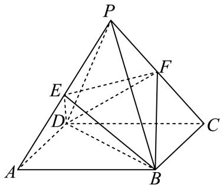

<!-- question-source:start -->
3、如图，在正四棱锥 $P - ABCD$ 中， $\pmb{E}$ ， $\pmb{F}$ 分别是 $PA$ ， $PC$ 的中点，则下列结论正确的是（）

A 设 $PD \cap$ 平面 $BEF = Q$ ，则 $\frac{PQ}{PD} = \frac{1}{3}$

B 三棱锥 $E - BDF$ 与正四棱锥 $P - ABCD$ 的体积之比为 $1:4$

C 若 $\frac{PA}{AB} = \frac{\sqrt{5}}{2}$ ，则正四棱锥 $P - ABCD$ 内切球与外接球的半径之比为 1:6

D 正四棱锥 P - ABCD 被平面 BEF 分成的上、下两部分的体积之比为 1 : 5
<!-- question-source:end -->

![[Q00092399A1]]
