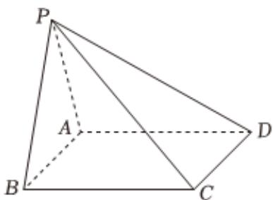

<!-- question-source:start -->
2. 如图，在四棱锥 $P - ABCD$ 中， $\triangle PAB$ 是等边三角形，四边形 $ABCD$ 是正方形， $PC = \sqrt{2} AB$ .

1 证明：平面 $PAB \perp$ 平面ABCD.

2 求平面PCD与平面ABCD所成角的正弦值.
<!-- question-source:end -->

![[Q00092404A1]]
