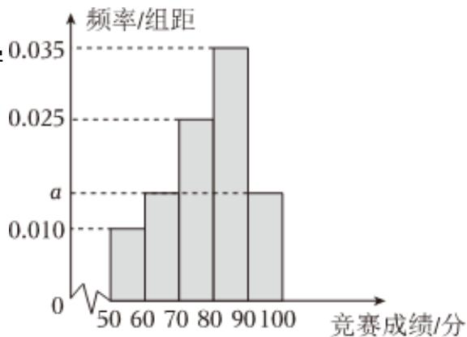

<!-- question-source:start -->
3、

某中学组织了一次文学常识知识竞赛（满分：100分），从参赛学生中随机抽取100名学生的成绩并进行整理，按[50, 60)，[60, 70)，[70, 80)，[80, 90)，[90, 100]分成五组，得到如图所示的频率分布直方图.

1 求频率分布直方图中a的值；

2 估计该中学学生这次文学常识知识竞赛成绩的第60百分位数；

3

现从被抽取的竞赛成绩在[50, 70)内的学生中按分层随机抽样的方法抽取5人进行座谈了解，再从这5人中随机抽取2人作发言，求抽取的2人恰好在同一组的概率.
<!-- question-source:end -->

![[Q00092405A1]]
