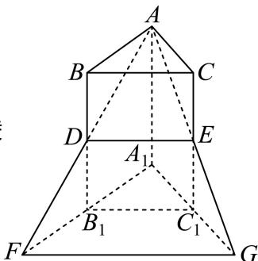

<!-- question-source:start -->
5、

定义：两个多面体 $M_{1}$ ， $M_{2}$ 的重合度 $K = \frac{V_{\text{公共}}}{V_1 + V_2 - V_{\text{公共}}}$ ，其中 $V_{\text{公共}}$ 是多面体 $M_{1}$ ， $M_{2}$ 的重合部分的体积， $V_{1}$ ， $V_{2}$ 分别是多面体 $M_{1}$ ， $M_{2}$ 的体积.如图，在三棱柱 $ABC - A_{1}B_{1}C_{1}$ 中， $D$ ， $E$ 分别是棱 $BB_{1}$ ， $CC_{1}$ 上的点（不包含端点），且 $BD = CE$ ，延长 $AD$ ， $AE$ ，分别交 $A_{1}B_{1}$ ， $A_{1}C_{1}$ 的延长线于点 $F$ ， $G$

已知 $BD = \frac{1}{2} BB_{1}$ ，且三棱柱 $ABC - A_{1}B_{1}C_{1}$ 的体积为18.

①求三棱柱 $ABC-A_{1}B_{1}C_{1}$ 与三棱锥 $A-A_{1}FG$ 重合部分的体积；

1 ②求三棱柱 $ABC-A_{1}B_{1}C_{1}$ 与三棱锥 $A-A_{1}FG$ 的重合度K.

2 若三棱柱 $ABC - A_{1}B_{1}C_{1}$ 与三棱锥 $A - A_{1}FG$ 的重合度 $K = \frac{1}{3}$ ，求 $\frac{BD}{BB_{1}}$ 的值.
<!-- question-source:end -->

![[Q00092407A1]]
